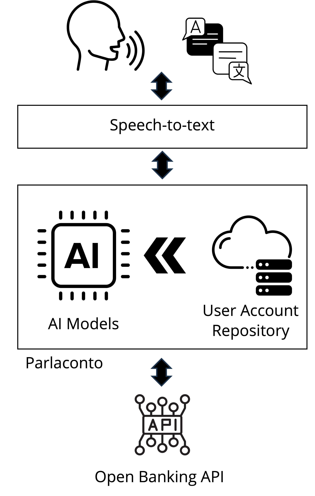

#  Parlaconto

Parlaconto dà voce al tuo conto utilizzando modelli linguistici autogenerativi.

Ridefinisce gli standard di accessibilità ai servizi bancari grazie alla nuova naturalità che offre alle interazioni.

# Proof Of Concept
Il Proof Of Concept realizzato per Hack to Innovate 2023 definisce una **Amazon Alexa Skill**
che integra ChatGPT 3.5 ed un contesto di informazioni bancarie, rivelando le capacità
che Parlaconto e i modelli LLM riescono a offrire.

- L'utente interagendo con Alexa attiva la Amazon Alexa Skill Parlaconto tramite voce.
- Quindi pone query vocali all'assistente, che vengono tradotte in testo dall'API Alexa.
- La nostra lambda trasforma le richieste verso chiamate alle API di ChatGPT 3.5, arricchendo le richieste con un contesto di informazioni mock che rappresentano i movimenti bancari dell'utente.
- Le risposte del modello linguistico vengono fornite in risposta ad Alexa, che le sintetizza vocalmente.

# Architettura

L’utente pone domande (testo/voce) a Parlaconto, un modulo speech-to-text trasforma le domande in query testuali e sintetizza vocalmente le risposte.

Parlaconto reperisce i dati bancari di interesse con API interoperabili (es. OpenBanking PSD2) e crea il contesto in cui l’AI genera le risposte alle query utente, mentre le richieste esecutive possono trasformarsi in operazioni (disposizioni) sul proprio conto.

Parlaconto userà un proprio modello linguistico **fine-tuned** per il dominio bancario, estendendo modelli linguistici open-source (LLaMa/Cloude) per supportare il Private-Cloud e la compliance a privacy e sicurezza dei dati.

Il limite dei token di contesto sarà risolto partizionando l’insieme dei dati in base alle richieste utente.

Parlaconto potrà essere offerto in:
- Assistenti Vocali (Google Assistant, Siri).
- Assistenti in-app alle app bancarie.
- Stand-alone interagibile con API.

# Autori

Parlaconto è una idea Fervento, start-up che progetta, sviluppa e coordina team di progetti innovativi per servizi Cloud e IoT.
- [Fabio Scippacercola](https://www.linkedin.com/in/fabio-scippacercola-471133153/)
- [Michele Basile](https://www.linkedin.com/in/michele-basile-54616588/)
- [Ermanno Battista](https://www.linkedin.com/in/ermannobattista/)
- [Luca Bianco](https://www.linkedin.com/in/luca-bianco-899b39254/)
- [Gennaro Nappi](https://www.linkedin.com/in/gennaronappi/)